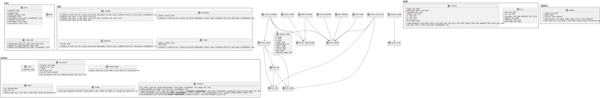
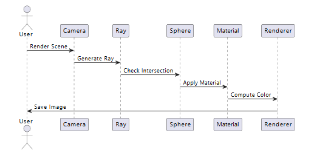

# Ray Tracers: Golang and CUDA Versions

This repository contains two implementations of a ray tracer:
- A **Golang ray tracer** in the `ray_tracer_go_v2` folder.
- A **CUDA ray tracer** in the `ray_tracer_cuda` folder.

Both ray tracers render scenes defined in JSON files and allow for flexible configuration via command-line arguments. The programs also include default scenes showcasing various materials and objects.

---

## Features
- Supports rendering 3D scenes described in JSON files.
- Parallel processing for optimized performance:
    - **Golang ray tracer**: Multithreading via goroutines.
    - **CUDA ray tracer**: GPU-based parallelism with adjustable blocks and threads.
- Command-line arguments for customizable output.
- Built-in testing frameworks for verifying components.

---

## Program Structure

### Golang Ray Tracer
The Golang ray tracer (`ray_tracer_go_v2`) is structured into modules that handle:
- **JSON parsing**: Reads and interprets the scene description.
- **Ray generation**: Constructs rays from a virtual camera.
- **Object interaction**: Computes intersections between rays and objects.
- **Material handling**: Applies material properties for realistic lighting.
- **Image creation**: Outputs rendered images as `.ppm` files.

### CUDA Ray Tracer
The CUDA ray tracer (`ray_tracer_cuda`) is implemented in C++ with CUDA for GPU acceleration. Key modules include:
- **Camera**: Manages the virtual viewpoint and ray directions.
- **Scene objects**: Sphere-based primitives with materials.
- **Ray-object intersection**: Computes collisions using GPU threads.
- **Material rendering**: Simulates lighting and reflections.
- **Parallelism**: Configurable via CUDA blocks and threads.

## Diagrams

### Class Diagram

The following class diagram provides an overview of the architecture of the CUDA-based ray tracer. It shows the relationships between core components, such as the **camera**, **rays**, **materials**, **objects**, and the rendering pipeline.



#### Key Highlights:
1. **Namespaces**:
    - The codebase is modularized into the following namespaces:
        - **`calc`**: Utility classes for 3D vector and mathematical operations.
        - **`emit`**: Classes for rays and the camera.
        - **`mat`**: Abstract `material` class and its concrete implementations (`lambertian`, `metal`, `dielectric`).
        - **`canvas`**: Core ray-tracing abstractions, including `intersectable`, `renderer`, and `image`.
        - **`objects`**: Defines renderable objects like `sphere`.

2. **Core Components**:
    - **`emit::camera`**:
        - Generates rays for each pixel in the image.
    - **`emit::ray`**:
        - Represents rays in the scene and their attributes (origin and direction).
    - **`mat::material`** and its Subclasses:
        - Handle how objects interact with light, including scattering, reflection, and refraction.
    - **`canvas::intersectable`**:
        - Abstract base class for objects that can be intersected by rays.
        - Implemented by `objects::sphere` and `canvas::hitlist`.
    - **`canvas::renderer`**:
        - Manages the rendering process, including creating the world, tracing rays, and generating the final image.

3. **Configuration**:
    - **`sphere_config`**:
        - Provides configuration for sphere objects loaded from JSON files.

4. **Relationships**:
    - **Inheritance**:
        - `objects::sphere` and `canvas::hitlist` inherit from `canvas::intersectable`.
        - `lambertian`, `metal`, and `dielectric` inherit from `mat::material`.
    - **Dependencies**:
        - The `renderer` interacts with the `camera`, `intersectable`, and `material` components to render the scene.

---

#### Note on the Golang Implementation:
The Golang version of the ray tracer is structurally similar to the CUDA implementation. Most core abstractions and relationships remain unchanged, though they are implemented using Go’s standard library and concurrency model. Since the architecture closely mirrors the CUDA version, this class diagram is representative of both implementations.


### Sequence Diagram
The following sequence diagram demonstrates the flow of rendering a single pixel:



---

## Build Instructions

### Golang Ray Tracer
1. Navigate to the `ray_tracer_go_v2` folder:
   ```sh
   cd ray_tracer_go_v2
   ```
2. Build the project:
   ```sh
   go build
   ```

### CUDA Ray Tracer
1. Navigate to the `ray_tracer_cuda` folder:
   ```sh
   cd ray_tracer_cuda
   ```
2. Build the project using `nvcc`:
   ```sh
   nvcc main.cu tests/calc/test_math_utils.cu tests/calc/test_vecs.cu \
   tests/canvas/test_hitlist.cu tests/canvas/test_intersectable.cu \
   tests/emitters/test_camera.cu tests/emitters/test_ray.cu \
   tests/material/test_materials.cu tests/objects/test_sphere.cu \
   -o ray_tracer \
   -I./Calc -I./canvas -I./cuda_o -I./emitters -I./include -I./material -I./objects -I./tests
   ```

---

## Run Instructions

### Golang Ray Tracer
Run the ray tracer with:
```sh
./ray_tracer_go_v2 [flags]
```

#### Flags:
- `-fn`: Path to save the generated image (default: `.\created_images\default.ppm`).
- `-j`: Path to the JSON scene file (default: `.\scenes\default_scene.json`).
- `-p`: Number of processes for parallelism (default: number of CPUs).
- `-t`: Number of goroutines for parallelism (default: 4).
- `-wi`: Image width (default: 1200).
- `-hi`: Image height (default: 800).

Example:
```sh
./ray_tracer_go_v2 -fn .\output\image.ppm -j .\scenes\custom_scene.json -wi 1920 -hi 1080
```

### CUDA Ray Tracer
Run the ray tracer with:
```sh
.\ray_tracer.exe [arguments]
```

#### Arguments:
- `--width`: Image width.
- `--height`: Image height.
- `--filename`: Path to save the generated image.
- `--json`: Path to the JSON scene file.
- `--num_blocks`: Number of thread blocks.
- `--num_threads`: Number of threads per block.
- `--run_tests`: Run all unit tests and exit.

Example:
```sh
.\ray_tracer.exe --width 1920 --height 1080 --filename .\output\image.ppm --json .\scenes\custom_scene.json
```

---

## Run Tests

### Golang Tests
1. Navigate to the `tests` folder:
   ```sh
   cd ray_tracer_go_v2/tests
   ```
2. Run the tests:
   ```sh
   go test
   ```

### CUDA Tests
Run the CUDA tests directly using the `--run_tests` flag:
```sh
.\ray_tracer.exe --run_tests
```

---

## References

- **CUDA Toolkit Documentation**: [https://developer.nvidia.com/cuda-zone](https://developer.nvidia.com/cuda-zone)
- **Go Programming Language**: [https://golang.org/doc/](https://golang.org/doc/)
- **PPM Image Format Specification**: [https://netpbm.sourceforge.net/doc/ppm.html](https://netpbm.sourceforge.net/doc/ppm.html)

*The above references provide detailed documentation on CUDA programming, Go language, and the PPM file format used for image output.*

---

## Notes
- Both ray tracers are configured with default settings and a sample scene for quick testing.
- Ensure the CUDA environment is installed and configured for building and running the CUDA ray tracer.
- Modify the default JSON scenes to experiment with custom setups.
